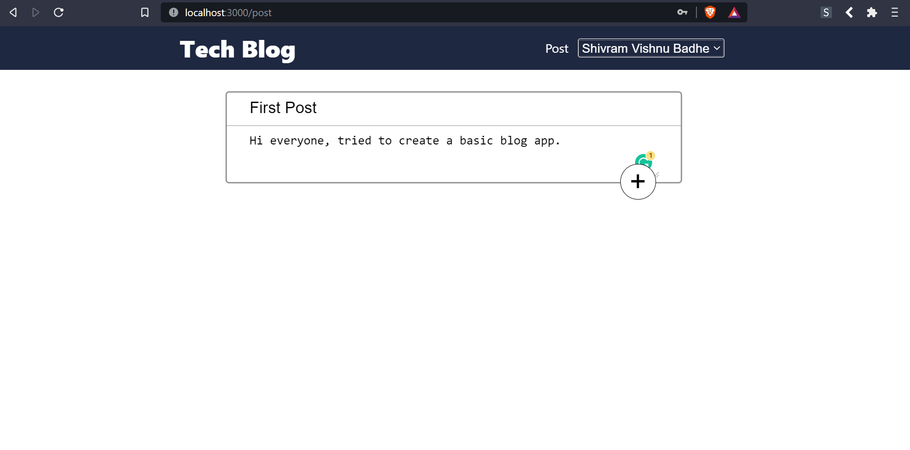
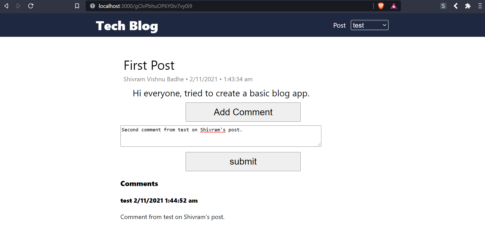

<div id="top"></div>

[![LinkedIn][linkedin-shield]][linkedin-url]


<!-- TABLE OF CONTENTS -->
<details>
  <summary>Table of Contents</summary>
  <ol>
    <li>
      <a href="#about-the-project">About The Project</a>
      <ul>
        <li><a href="#built-with">Built With</a></li>
      </ul>
    </li>
    <li>
      <a href="#getting-started">Getting Started</a>
      <ul>
        <li><a href="#prerequisites">Prerequisites</a></li>
        <li><a href="#installation">Installation</a></li>
      </ul>
    </li>
    <li><a href="#contact">Contact</a></li>
  </ol>
</details>


<!-- ABOUT THE PROJECT -->
## About The Project

Tried to create a basic blog web app from scratch with following features:
* Login
* Register
* Post blogs
* Delete your own blogs
* See what other people are posting
* Comment on any blog

Post             |  Comment
:-------------------------:|:-------------------------:
  |  


<p align="right">(<a href="#top">back to top</a>)</p>


### Built With

Major frameworks/libraries used in this project:

* [React.js](https://reactjs.org/)
* [Express.js](https://expressjs.com/)
* [Mongoose.js](https://mongoosejs.com/)

<p align="right">(<a href="#top">back to top</a>)</p>


<!-- GETTING STARTED -->
## Getting Started

To get a local copy up and running follow these simple example steps.

### Prerequisites

[MongoDB local community server](https://www.mongodb.com/try/download/community)

List things you need to use the software and how to install them.
* npm
  ```sh
  npm install npm@latest -g
  ```

### Installation

How to install and set up the app.

1. Clone the repo
   ```sh
   git clone https://github.com/svbadhe/blog.git
   ```
2. Install NPM packages for server, go to the "blog/blog-server" directory
   ```sh
   npm install
   ```
3. Start the server
   ```js
   nodemon index.js
   ```
4. Install NPM packages for client, go to the "blog/blog-client" directory
   ```sh
   npm install
   ```
5. Run the project
   ```js
   npm start
   ```

<p align="right">(<a href="#top">back to top</a>)</p>


<!-- CONTACT -->
## Contact


Mail | svbadhe1999@gmail.com
:-------------------------:|:-------------------------:
LinkedIn | [https://www.linkedin.com/in/shivram-badhe/](https://www.linkedin.com/in/shivram-badhe/)
Project Link | [https://github.com/svbadhe/blog](https://github.com/svbadhe/blog)


<p align="right">(<a href="#top">back to top</a>)</p>


<!-- MARKDOWN LINKS & IMAGES -->

[linkedin-shield]: https://img.shields.io/badge/-LinkedIn-black.svg
[linkedin-url]: https://www.linkedin.com/in/shivram-badhe/
[blog-post]: blog-post.png
[blog-comment]: blog-comment.png
